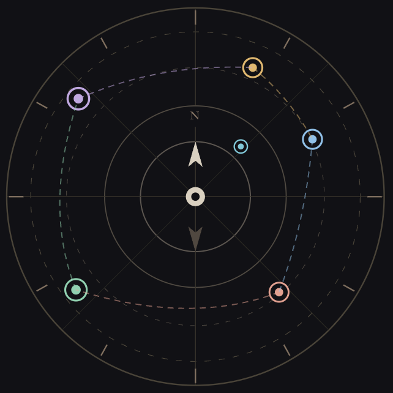
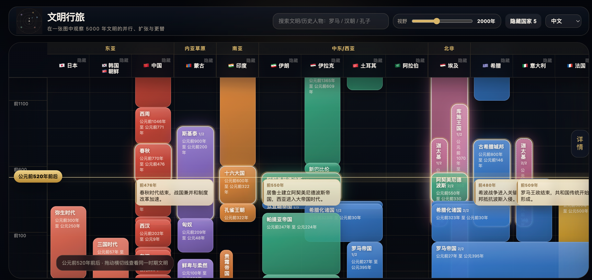
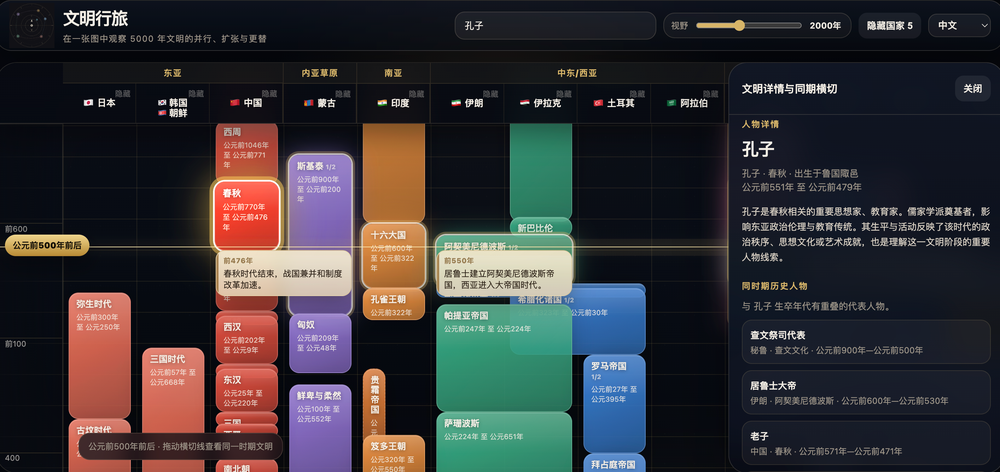
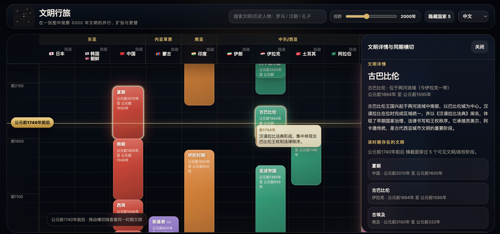

# CivVoyage · 文明行旅

<p align="center">
  
</p>

<p align="center">
  <strong>Journey across civilizations through time and place.</strong>
</p>

<p align="center">
  <a href="#features">Features</a> ·
  <a href="#screenshots">Screenshots</a> ·
  <a href="#quick-start">Quick Start</a> ·
  <a href="#deployment">Deployment</a> ·
  <a href="#roadmap">Roadmap</a>
</p>

---

## Overview

**CivVoyage** is an interactive world civilization timeline atlas. It lets users travel through history by dragging a vertical time axis, comparing civilizations across regions, discovering major historical events, and searching for both civilizations and historical figures.

Unlike a traditional static timeline, CivVoyage is designed as an exploratory historical interface: civilizations are represented as visual layers across time and geography, while the user moves through eras as if navigating a map of human history.

> The goal is not to replace academic historical databases, but to offer an intuitive, beautiful, and engaging way to understand how civilizations coexisted, expanded, overlapped, and transformed.

---

## Screenshots

### Civilization Atlas Overview



### Search Civilizations and Historical Figures



### Timeline Events and Contextual Exploration



---

## Features

### Interactive Civilization Timeline

- Vertical time axis covering ancient to modern history
- Region and country-based civilization columns
- Civilization blocks representing dynasties, empires, kingdoms, and cultural phases
- Partial-width blocks for local occupation, regional overlap, or parallel civilizations
- Layering logic so later civilizations appear above earlier ones

### Time Cross-Section Exploration

- Drag the year line to inspect a specific era
- See civilizations that existed at the selected time
- Major historical events appear near the time line
- Event cards are positioned under the relevant country column

### Civilization and Figure Search

- Search civilizations, dynasties, empires, and historical phases
- Search historical figures such as Confucius, Qin Shi Huang, Caesar, Augustus, Genghis Khan, Napoleon, Lincoln, and more
- Searching a figure highlights the civilization block associated with that person
- Detail panel switches between civilization detail and figure detail

### Historical Figure Library

- Includes 300+ representative historical figures
- Covers rulers, philosophers, artists, scientists, religious figures, reformers, writers, and military leaders
- Figure detail includes associated civilization, birthplace/origin, lifetime, and concise introduction
- When viewing a figure, the side panel shows contemporary historical figures

### Major Event Layer

- Displays up to four major events near the current time line
- Events are anchored to the relevant country column
- Event cards show specific year and concise historical description
- Designed to add historical context without overcrowding the visualization

### Bilingual Interface

- Chinese / English language switch
- Product title, UI labels, country headers, civilization labels, search results, dates, and detail sections support English display

### Lightweight and Static

- Pure HTML / CSS / JavaScript
- No build step required
- No backend required
- Works well with GitHub Pages

---

## Design Principles

CivVoyage follows several historical visualization rules:

- Cultural influence does not automatically create a cross-region block
- Border conflicts are not shown as full territorial control
- Partial occupation is represented with partial-width blocks
- Full-width cross-column blocks are reserved for direct rule, political integration, or empire-level control
- Non-contiguous territories are not visually connected through unrelated countries
- Overlapping civilizations in the same country can be shown as partial blocks
- Related civilizations use similar color families while neighboring civilizations remain visually distinct

---

## Quick Start

Clone or download the repository, then open `index.html` directly:

```bash
open index.html
```

Or serve it locally:

```bash
python3 -m http.server 8770
```

Then visit:

```text
http://localhost:8770
```

---

## Project Structure

```text
civilization-timeline/
├── index.html
├── README.md
├── .gitignore
└── assets/
    ├── logo.png
    └── screenshots/
        ├── overview.png
        ├── search-and-detail.png
        └── events-and-figures.png
```

---

## Deployment

CivVoyage is a static site and can be deployed directly with GitHub Pages.

### GitHub Pages

1. Create a GitHub repository, for example:

```text
civvoyage
```

2. Push the project files to the repository root.

3. Open repository settings:

```text
Settings → Pages → Build and deployment
```

4. Select:

```text
Source: Deploy from a branch
Branch: main
Folder: /root
```

5. The live site will be available at:

```text
https://<your-github-username>.github.io/civvoyage/
```

---

## Current Status

CivVoyage is currently an MVP / prototype. The interaction model, visual style, search flow, event layer, bilingual UI, and historical figure exploration are implemented. Historical data will continue to be refined.

### What is included now

- Single-page interactive timeline atlas
- Country and region headers
- Civilization blocks
- Search system
- Historical figure library
- Major event layer
- Bilingual UI
- Detail side panel
- Logo and screenshots

### Known limitations

- Historical data is curated for demonstration and may require further academic review
- English translations are functional but not yet fully copyedited for every item
- The project currently stores all data inside `index.html`
- Some historical boundaries are simplified for visual clarity

---

## Roadmap

Potential future improvements:

- Move civilization, figure, and event data into separate JSON files
- Improve historical accuracy and add source references
- Add more carefully curated English descriptions
- Add timeline bookmarks and thematic journeys
- Add export / share image function
- Add mobile-specific layout
- Add richer event interactions
- Add public contribution workflow for historical data corrections

---

## Philosophy

History is often taught as isolated regional stories. CivVoyage tries to make history feel simultaneous: while one empire rises, another city is flourishing, a philosopher is writing, a kingdom is collapsing, and a new religious or political order is emerging elsewhere.

By moving through time and place together, users can experience civilization not as a list, but as a living map of overlapping human worlds.

---

## License

This project is licensed under **Creative Commons Attribution-NonCommercial 4.0 International (CC BY-NC 4.0)**.

You may use, share, and adapt this project for non-commercial purposes with attribution.

Commercial use is not permitted without explicit permission.

See [LICENSE](LICENSE) for details.

---

## Author

Created as an experimental AI-assisted historical visualization project.
